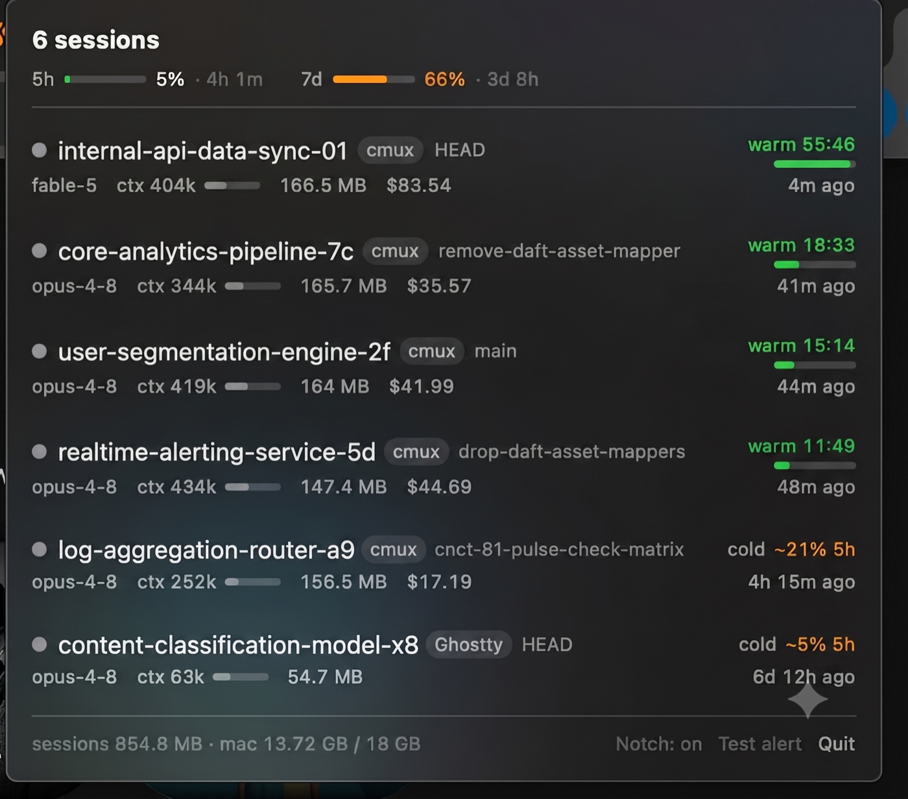

<p align="center">
  
</p>

<h1 align="center">Cachewatch</h1>

<p align="center">A macOS menu bar app that watches all your Claude Code sessions at once — live status, prompt-cache state with TTL countdowns, real quota usage, per-session memory, and the cost of waking a cold session.</p>

<p align="center">
  
  <br>
  <sub>Session names in this screenshot were regenerated with Gemini to scrub work-specific project names — the layout and data are real.</sub>
</p>

## Why

Claude Code shows you one session at a time. Run several in parallel and there's no view of which ones are waiting for your input, which caches are about to expire, how much of your 5-hour and weekly quota is gone, or how much memory that session you abandoned three days ago is still holding. Cachewatch is that view, plus notifications when something needs you.

## What it shows

- **Session fleet** — every live session: project, git branch, model, status (idle / busy / **needs input**), which app hosts it (click the tag to focus that terminal), input-starved sessions sorted first. The menu bar icon shows a count when sessions are waiting on you.
- **Cache state** — warm/cold per session with a live TTL countdown and drain bar, read from the transcript's actual `ephemeral_5m` / `ephemeral_1h` cache buckets, not guessed. Includes a silent cache-miss detector for the `--resume`/upgrade regressions that quietly pay full rewrites.
- **Cost to resume** — cold sessions show what the full-context rewrite will cost on your next prompt. Dollars on API billing; on a subscription, Cachewatch **calibrates your account's real quota weighting** by pairing observed token spend with the server-reported used-%, then shows it as `~N% 5h` — the unit that actually means something on a Plan.
- **Quota** — server-reported 5-hour and weekly utilization with fill bars and reset countdowns, merged monotonically so stale renders from idle sessions can't regress it. When a window resets while you're away, the badge says so. History is recorded to a rolling 30-day JSONL for burn-rate analysis.
- **Memory** — RSS of each session's full process tree (MCP servers included), plus a machine-wide footer (`sessions 1.0 GB · mac 14 GB / 18 GB`).
- **Notifications** — quota crossing 80%, a big 5-minute-TTL cache about to die, sessions stuck waiting for input, long busy turns finishing, heavy sessions idle 6+ hours, silent cache misses. Each fires once, survives restarts, individually toggleable. On notched Macs they animate out of the notch; elsewhere they fall back to standard notifications.
- **Notch panel (opt-in)** — hover the notch dead zone and the fleet panel flows out beneath it. Nothing is displayed there otherwise; the notch is an interaction zone, not a billboard.
- **Close session** — hover a row for a confirm-gated button that terminates that Claude Code process.

## How it works

No API calls, no tokens spent, no accounts. Cachewatch reads what Claude Code already writes locally:

| Source | Provides |
|---|---|
| `~/.claude/sessions/*.json` | Session discovery, pid, live status (PID-validated) |
| `~/.claude/projects/**/*.jsonl` | Per-turn tokens, cache read/write with TTL buckets, model, branch |
| Statusline forwarder (below) | Quota (`rate_limits`), cost, context %, per session |
| `ps` | Process-tree memory and host-app detection |

Everything flows into one reducer producing an immutable fleet snapshot; the UI renders snapshots. All fleet state is rebuilt from disk at launch — the only persistence is one `state.json` (preferences, alert dedup, calibration fit, last-seen quota) and the quota-history JSONL.

## Install

Requires macOS 15+ and Swift 6 (Command Line Tools are enough to build and run).

```sh
git clone https://github.com/fyzanshaik/cachewatch && cd cachewatch
swift run Cachewatch          # menu bar app
swift run Cachewatch dump     # one-shot fleet table in the terminal
```

### Statusline hookup (for quota/cost data)

Quota and cost come from the JSON Claude Code pipes to its statusline. Install the forwarder:

```sh
mkdir -p ~/.cachewatch && cp scripts/cachewatch-statusline.sh ~/.cachewatch/ && chmod +x ~/.cachewatch/cachewatch-statusline.sh
```

Then in `~/.claude/settings.json`:

```json
"statusLine": {
  "type": "command",
  "command": "~/.cachewatch/cachewatch-statusline.sh",
  "refreshInterval": 60
}
```

The script renders a compact statusline (`Opus 4.8 | ctx 73% | 5h 43% | 7d 12%`) and forwards the JSON to Cachewatch's local socket. Already have a statusline you like? Set `CACHEWATCH_NEXT_STATUSLINE` to its command and the script chains to it. If Cachewatch isn't running the forward is a silent no-op — your statusline never breaks or slows down. `refreshInterval` keeps quota fresh while sessions idle; sessions pick the setting up on restart.

### Custom icon

Drop any image at `~/.cachewatch/icon.png` and it becomes the menu bar icon and notification mascot — flat backgrounds are keyed out automatically, so pixel-art sprites drop in as-is. Without one, the built-in starburst is used.

## Configuration

`~/Library/Application Support/Cachewatch/state.json`:

```json
{
  "alerts": {
    "notificationsEnabled": true,
    "quota":        { "enabled": true, "thresholdPercentage": 80 },
    "cacheExpiry":  { "enabled": true, "warningSeconds": 90, "minContextTokens": 50000 },
    "longIdle":     { "enabled": true, "idleHours": 6, "minContextTokens": 100000, "minMemoryBytes": 500000000 },
    "cacheMiss":    { "enabled": true },
    "needsInput":   { "enabled": true, "afterSeconds": 120 },
    "turnFinished": { "enabled": true, "minBusySeconds": 300 }
  },
  "notchHUDEnabled": false
}
```

Delete the file for a factory reset. Missing fields decode to defaults, so upgrades never migrate.

## Caveats

- The session registry, transcript schema, and statusline JSON are undocumented Claude Code internals; they have changed without notice before and will again. Parsers are fixture-tested against real captured payloads and degrade per-field, but a Claude Code update can still break things — file an issue with a captured payload.
- The TTL countdown is a client-side expectation (last turn + TTL). Refresh-on-read is documented; guaranteed retention is not — early eviction is possible.
- Dollar figures use API list prices (`Sources/CollectorEngine/Pricing.swift`). On a subscription they're a proxy until the quota calibration fits, and the fitted `%` figures are estimates: Anthropic does not publish the Plan quota formula, so Cachewatch measures it from your own account's behavior.
- Quota freshness is bounded by statusline renders (per turn + `refreshInterval`). Reset countdowns and expired-window handling are pure local clock and stay correct regardless.

## Development

```sh
swift run cachewatch-tests    # test suite (plain-assertion runner; no Xcode required)
```

Engine logic lives in `Sources/CollectorEngine` (no UI imports); the app target is a thin SwiftUI shell. New data enters as a source emitting events into `FleetReducer`; new features are new derivations on the snapshot. Fixtures mirror real captured payloads, so schema drift breaks tests instead of silently breaking the app.

## License

[MIT](LICENSE)
